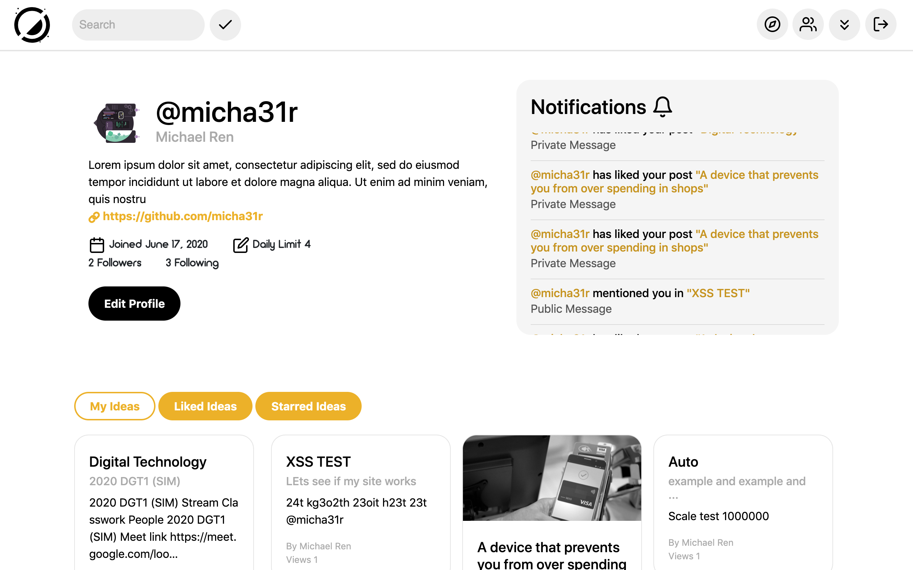
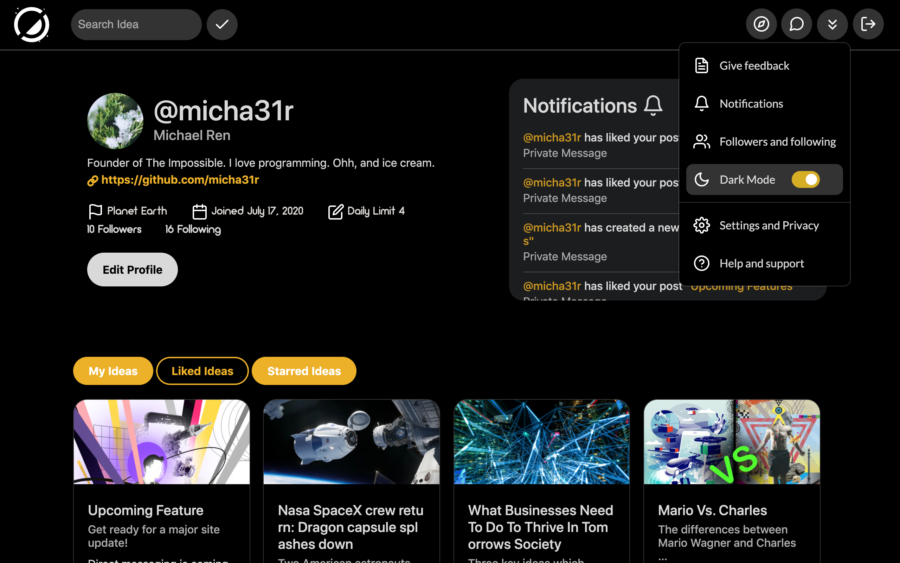
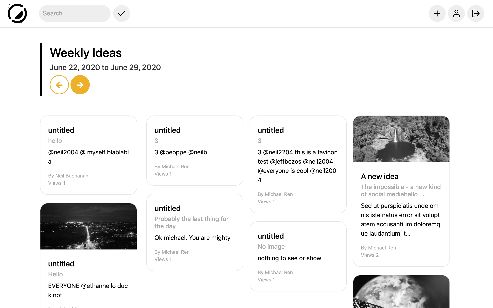
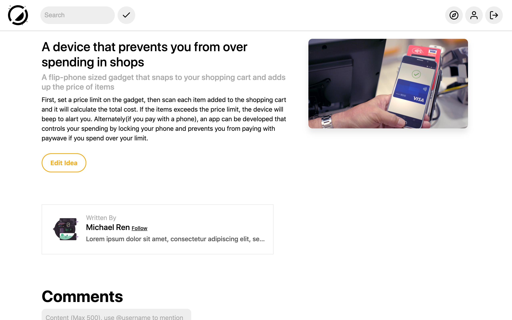

# The Impossible








##
__Development progress:__ 7/10 complete

__Current *site* version:__ *v0.1*

__Current library versions:__
  * [Python](https://www.python.org/) 3.6.4
  * [Django](https://www.djangoproject.com/) 2.2.7
  * Pytz 2019.3
  * Sqlparse 0.3.1
  * [Bootstrap](https://getbootstrap.com/) 4

__Icons used are from [Feather](https://feathericons.com/)__

# Start a local server for testing:
```bash
# Clone this repository
git clone https://github.com/micha31r/The-Impossible.git
# Go into repository
cd The-Impossible
# Create a virtual environment
python3 -m venv .
# Install libraries
pip install -r requirements.txt
# Activate python virtual environment on Mac
source bin/activate && cd src
# (On Windows)
Scripts\activate
cd src
""" 
Create a file under the_impossible folder called secret_key.txt
Then add ur own secret key, (Generate one from https://djecrety.ir/)

Now, because thsi site sends email to users, you need to configure your own email address in settings.py and create a file under the_impossible folder called email_password.txt which contains your email password

"""
# Create a folder under src staticfiles, then run
python manage.py collectstatic
# Create database and create superuser
python manage.py makemigrations
python manage.py migrate
python manage.py createsuperuser
# Runserver
python manage.py runserver
# Start another terminal session to run periodic tasks
python manage.py process_tasks
```
