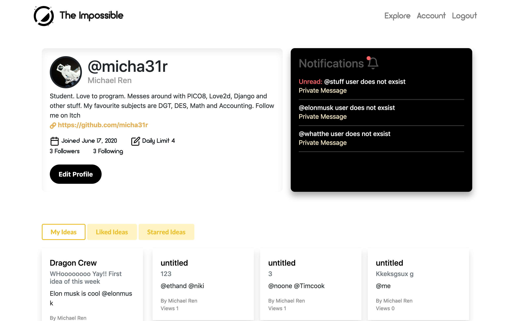
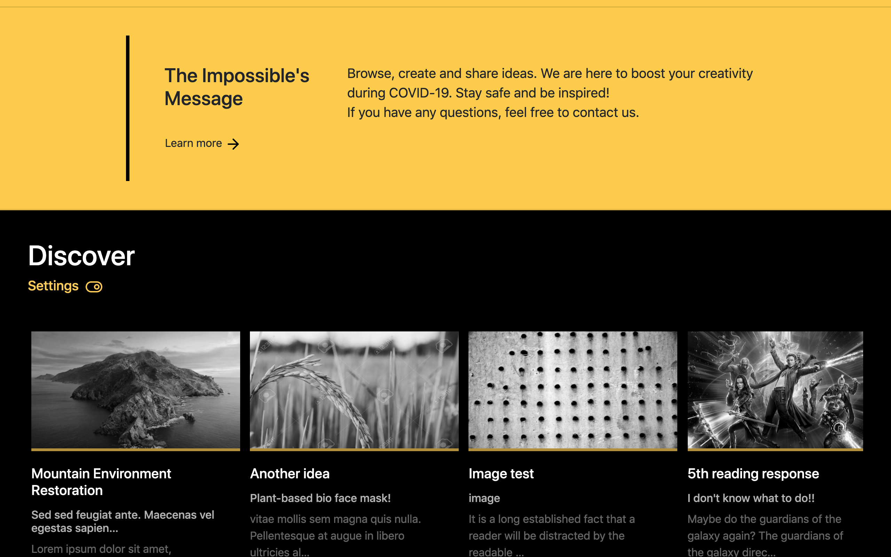
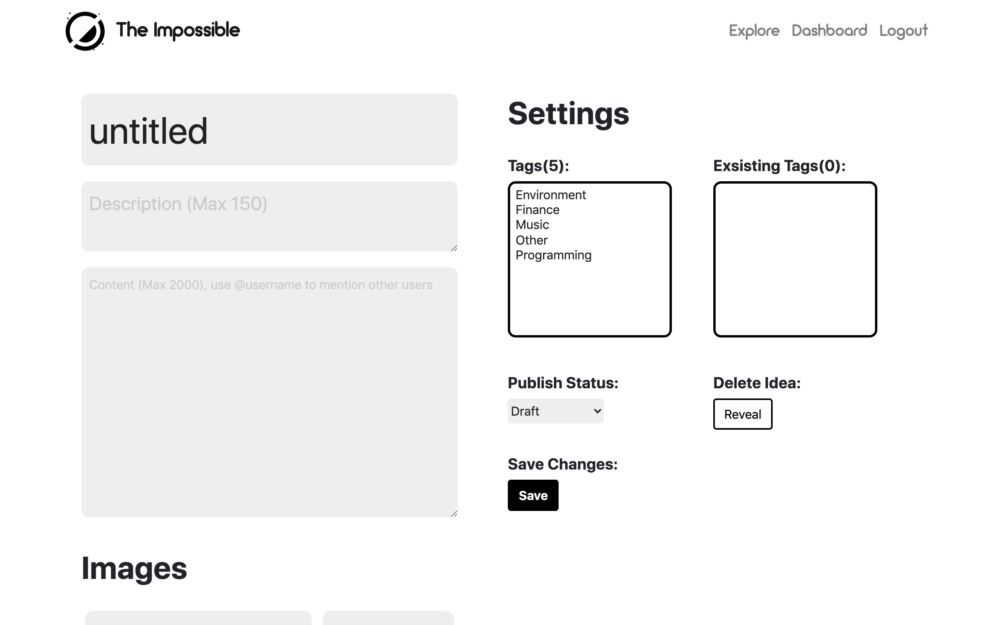
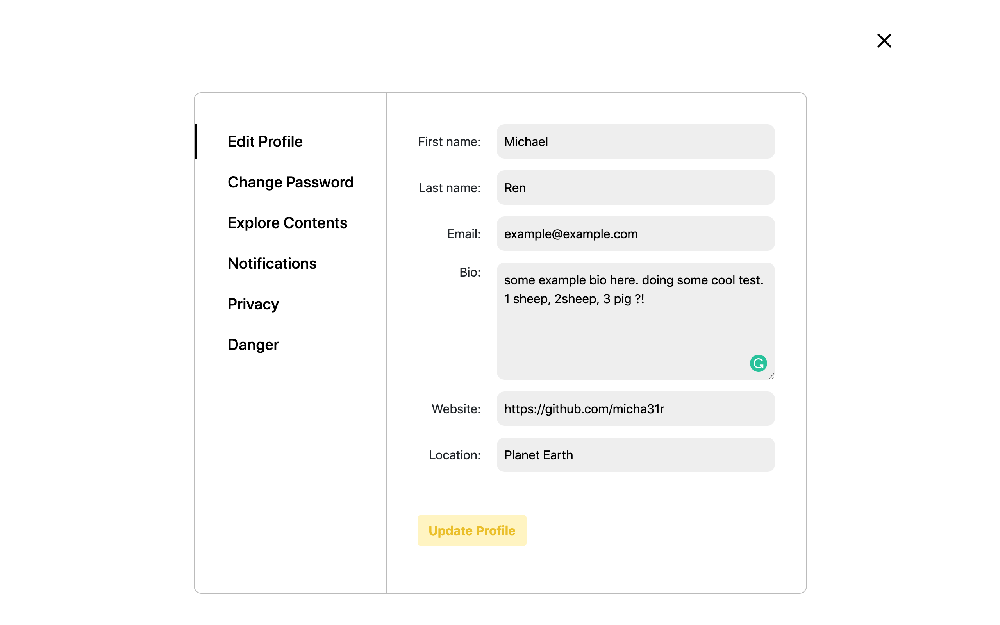

# The Impossible
**Too many good ideas are left in the dust. Sometimes, a world changing idea never sees daylight because we are too reluctant to share it with others, afraid that people will reject it, laugh at us, or claim as their own. All ideas deservers a chance to be developed. If you have a great idea but are not taking any actions, then share it and let it discovered by entrepenures makers and innovators. The Impossible is a social media that allows you to share your ideas and thoughts with the world. A place for inspiration, discussion and feedbacks.**

# Site Preview

## Dashboard

## Explore

## Discover

## Idea Editor

## Profile Editor


##

__Current *site* version:__ *v0.1*

__Current library versions:__
  * [Python](https://www.python.org/) 3.6.4
  * [Django](https://www.djangoproject.com/) 2.2.7
  * Pytz 2019.3
  * Sqlparse 0.3.1
  * Bootstrap 4

# Start a local server for testing:
```bash
# Clone this repository
git clone https://github.com/micha31r/The-Impossible.git
# Go into repository
cd The-Impossible
# Create a virtual environment
python3 -m venv .
# Install libraries
pip install -r requirements.txt
# Activate python virtual environment on Mac
source bin/activate && cd src
# (On Windows)
Scripts\activate
cd src
# Create a file under the_impossible folder called secret_key.txt
# Then add ur own secret key, (Generate one from https://djecrety.ir/)
...
# Create database and create superuser
python manage.py makemigrations
python manage.py migrate
python manage.py createsuperuser
# Runserver
python manage.py runserver
```